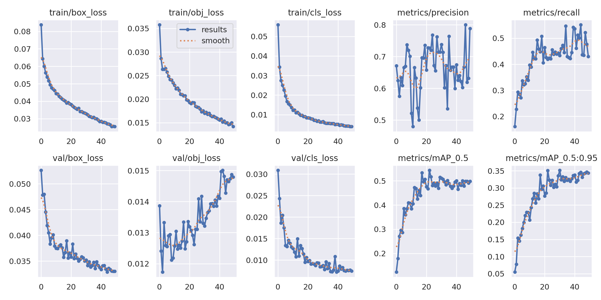

# Real-Time Object Detection System

A GPU-accelerated object detection system built with YOLOv5 and Streamlit, featuring CPU vs GPU performance benchmarking and a fine-tuned model trained on a custom construction equipment dataset.

## Features
- Real-time image and video object detection using YOLOv5
- CPU vs GPU inference benchmarking with statistical analysis (mean, median, p95, p99)
- Fine-tuned YOLOv5s on a custom 3,648-image construction equipment dataset across 19 classes
- Streamlit web interface with image detection, video detection, and benchmarking tabs
- Unit tested with pytest

## Project Structure
```
real-time_object_detection_system/
├── src/
│   ├── detector.py        # YOLOv5 inference for image and video
│   ├── benchmark.py       # CPU vs GPU benchmark runner
│   └── __init__.py
├── tests/
│   └── test_detector.py   # Unit tests
├── notebooks/
│   ├── yolo_finetune.ipynb    # Fine-tuning pipeline on Colab
│   └── yolo_benchmark.ipynb   # CPU vs GPU benchmark on Colab
├── results/
│   ├── training_results.json  # Fine-tuning metrics
│   ├── benchmark_results.json # Benchmark metrics
│   └── results.png            # Training curves
├── data/sample_images/    # Test images for benchmarking
├── app.py                 # Streamlit application
├── requirements.txt
└── README.md
```

## Setup
```bash
python -m venv venv
venv\Scripts\activate        # Windows
source venv/bin/activate     # Mac/Linux
pip install -r requirements.txt
```

## Run the App
```bash
streamlit run app.py
```

## Model Performance (Fine-Tuned on Construction Equipment)
Fine-tuned YOLOv5s on a 3,648-image construction equipment dataset with 19 classes including Excavator, Dump Truck, Front End Loader, Worker, Hard Hat, and Safety Vest.

| Metric        | Score  |
|---------------|--------|
| mAP@0.5       | 54.4%  |
| mAP@0.5:0.95  | 35.1%  |
| Precision     | 80.0%  |
| Recall        | 55.2%  |
| Best Epoch    | 23/50  |
| Dataset Size  | 3,648 images |
| Classes       | 19     |

### Training Curves


## Benchmark Performance (CPU vs GPU)
Benchmarked YOLOv5s inference over 100 iterations on a Colab T4 GPU.

| Metric        | CPU (ms) | GPU (ms) | Speedup |
|---------------|----------|----------|---------|
| Mean          | X        | X        | Xx      |
| Median        | X        | X        | Xx      |
| 95th Pct      | X        | X        | Xx      |

> GPU benchmark results pending — run `notebooks/yolo_benchmark.ipynb` on a CUDA-enabled machine to populate.

## Dataset
- **Source:** Construction Equipment Computer Vision Model (Roboflow Universe, CSR)
- **Images:** 3,648 (after augmentation)
- **Classes:** 19 (Excavator, Dump Truck, Front End Loader, Worker, Hard Hat, Safety Vest, and more)
- **Augmentations:** Horizontal flip, ±15° rotation, ±25% brightness
- **Split:** 70% train / 20% val / 10% test

## Tests
```bash
pytest -v
```

## Technologies
Python, PyTorch, YOLOv5, OpenCV, Streamlit, Roboflow, NumPy, Pandas, pytest
